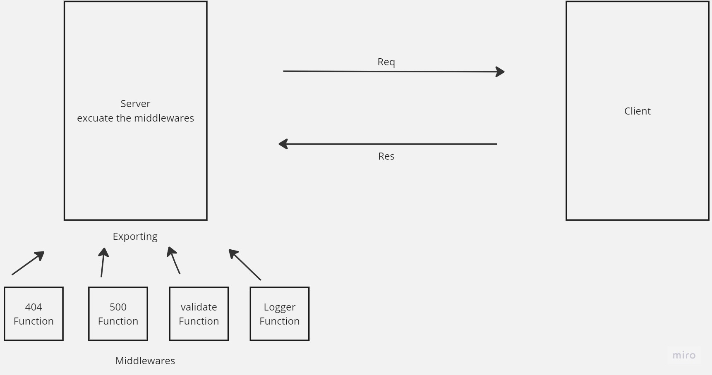

# basic-express-server

## Action Link : https://github.com/Hamzamt99/basic-express-server/actions

## Pull Link : https://github.com/Hamzamt99/basic-express-server/pull/7

## repo link : https://github.com/Hamzamt99/basic-express-server

## live url : https://basic-express-server-btkf.onrender.com

## Uml Diagram :

## notes from instructor during the lecture : 
### 1- we should have use logger in all levels which mean we should use it in every rout.
### 2- we have to use Spy to test the logger.
### 3- we should have test coverage 100%.
### 4- we have to practice on unit testing.